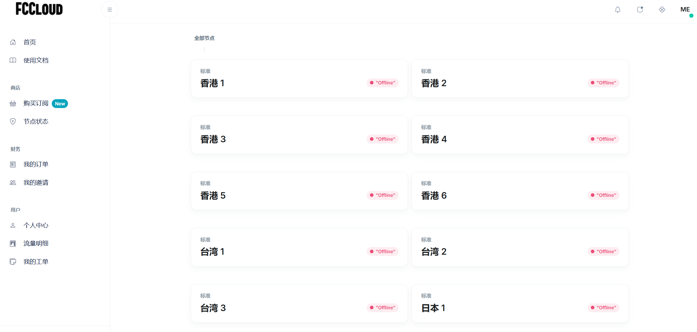
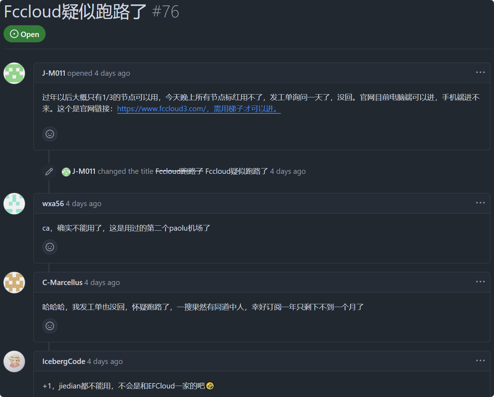

2025年2月11日，SFCloud 与 FCCloud 官方确认已跑路。官网无法访问，节点全挂，工单不回复。

**立即停止续费，避免更大损失！**

目前 [XSUS](https://xs-us.xyz/register?code=xJFcT1Dw) 表示可以接手SFCloud和FCCloud用户（按原订阅 30% 接收），详情可在[XSUS 官网](https://xs-us.xyz/register?code=xJFcT1Dw)注册后提交工单咨询。

选择机场时选择一些老牌机场（例如[大哥云](https://ermao.dgywzc.com/#/register?code=peAVAa8D)），可以减少跑路风险。

<!-- more -->

## 推测

SFCloud与FCCloud最初由EFCloud引流，但EFCloud已经在2025年1月25日跑路，SFCloud和FCCloud也很有可能已经跑路！

相关文章：[⚠️【机场跑路】2025年1月25日EFCloud机场跑路](/article/nz313xp6/)

## FCCloud节点无法使用截图

## 网友预警

## 机场跑路（预警）投稿

[点击投稿](https://pyjichang.com/scamvpn/)

## 其他推荐机场

::: warning
请注意，任何机场都有跑路的风险。建议备份一些按流量计费的机场以防失联，同时主要使用月付制的机场，尽量减少损失。
:::

[点击查看更多推荐机场](https://pyjichang.com/)
