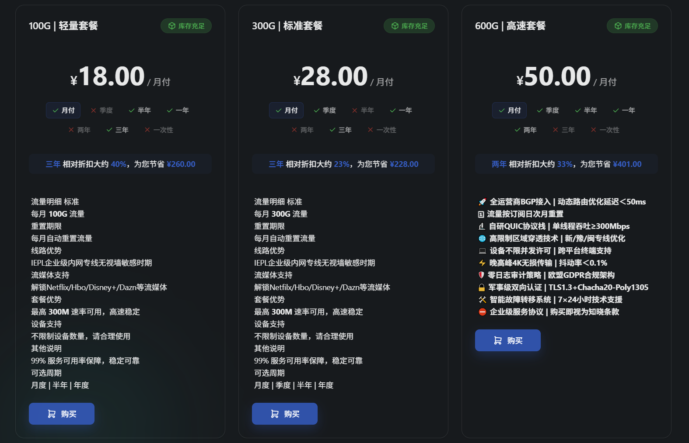
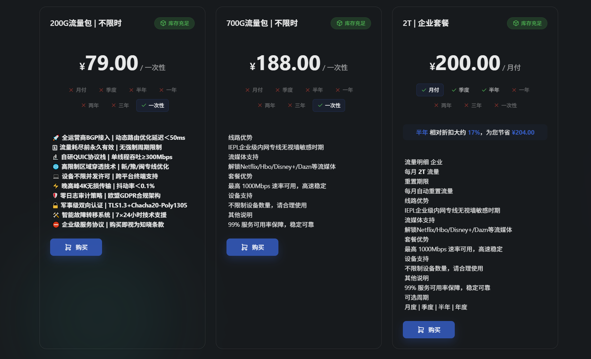
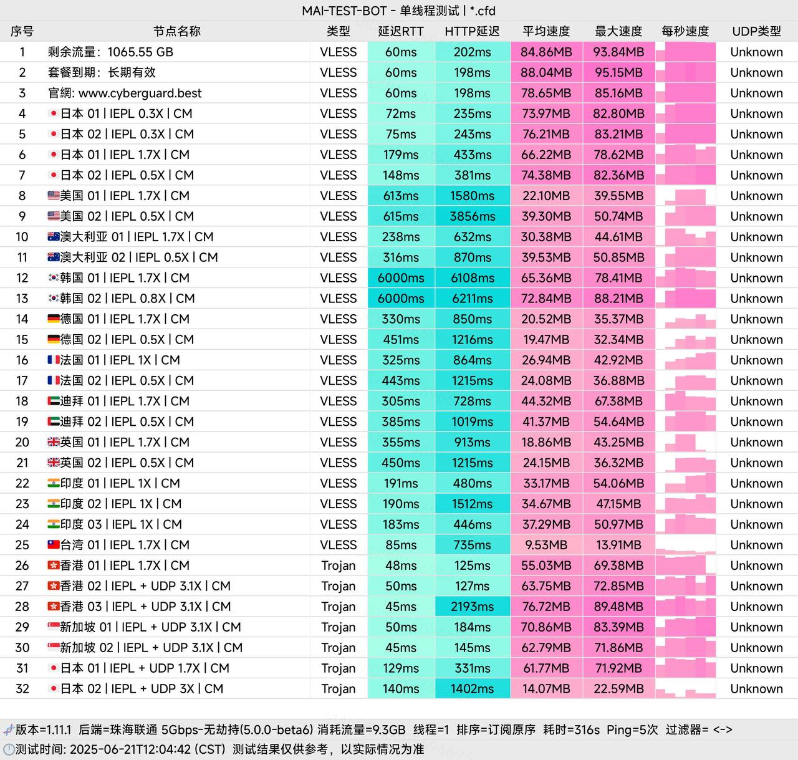

# CyberGuard机场2025年全面评测：高质量VPN代理服务的优选之一

在竞争激烈的VPN代理服务市场中，**CyberGuard机场**凭借其两年稳定运营的优异表现和高质量的服务脱颖而出。作为一家专注于提供高速、稳定、安全的科学上网解决方案的服务商，CyberGuard机场为用户提供多平台支持、全球节点覆盖和24/7专业客服，成为追求品质的用户首选。

**CyberGuard机场官方网站**：[cyberguard.best](https://www.cyberguard.best/#/register?code=yoyUW3R9)

<!-- more -->

## 什么是CyberGuard机场？深度了解这家高品质VPN服务商

[CyberGuard机场](https://www.cyberguard.best/#/register?code=yoyUW3R9)是一家专业的VPN代理服务提供商，自2023年开始运营至今已有两年时间。凭借稳定的服务质量和良好的用户口碑，CyberGuard机场在科学上网领域建立了良好的品牌形象。

### CyberGuard机场核心优势

**🚀 高速稳定的网络连接**
CyberGuard机场采用优质的服务器资源和先进的网络优化技术，为用户提供高速稳定的VPN连接，确保流畅的网络体验。

**🌍 全球节点覆盖**
提供覆盖多个国家和地区的服务器节点，包括香港、日本、美国、新加坡等热门地区，满足用户不同的地理位置需求。

**📱 多平台全面支持**
支持Windows、macOS、iOS、Android等主流操作系统，用户可以在不同设备上使用同一账号，实现无缝切换。

**🔒 强大的隐私保护**
采用军用级加密技术保护用户数据安全，严格的无日志政策确保用户隐私不被泄露。

**💬 专业客服团队**
提供24小时全天候客服支持，专业技术团队随时为用户解决使用过程中遇到的各种问题。

## CyberGuard机场官网入口

**官方网站**：[https://www.cyberguard.best](https://www.cyberguard.best/#/register?code=yoyUW3R9)

⚠️ 重要提醒：请务必通过官方渠道访问CyberGuard机场，避免访问虚假网站导致账户信息泄露或财产损失。

## CyberGuard机场套餐价格详细分析

CyberGuard机场提供灵活多样的套餐选择，从轻度用户到企业级需求都有相应的解决方案。所有套餐都支持多种付费周期，用户可以根据自己的需求和预算选择最合适的方案。

### 月付套餐推荐

| 套餐名称 | 月费价格 | 每月流量 | 适用人群 | 支付周期 | 购买链接 |
| --- | --- | --- | --- | --- | --- |
| 轻量套餐 | ¥18.00/月 | 100GB/月 | 轻度使用用户 | 月付、半年、一年、三年 | [立即购买](https://www.cyberguard.best/#/register?code=yoyUW3R9) |
| 标准套餐 | ¥28.00/月 | 300GB/月 | 中等需求用户 | 月付、季度、一年、三年 | [立即购买](https://www.cyberguard.best/#/register?code=yoyUW3R9) |
| 高速套餐 | ¥50.00/月 | 600GB/月 | 重度使用用户 | 月付、季度、半年、一年、两年 | [立即购买](https://www.cyberguard.best/#/register?code=yoyUW3R9) |
| 企业套餐 | ¥200.00/月 | 2TB/月 | 企业用户 | 月付、季度、半年 | [立即购买](https://www.cyberguard.best/#/register?code=yoyUW3R9) |

### 一次性流量包（不限时）

对于使用频率不固定的用户，CyberGuard机场还提供按量计费的不限时流量包，一次购买永久有效，更加经济实惠。

| 流量包容量 | 一次性价格 | 总流量 | 有效期 | 购买链接 |
| --- | --- | --- | --- | --- |
| 200GB流量包 | ¥79.00 | 200GB | 永久有效 | [立即购买](https://www.cyberguard.best/#/register?code=yoyUW3R9) |
| 700GB流量包 | ¥188.00 | 700GB | 永久有效 | [立即购买](https://www.cyberguard.best/#/register?code=yoyUW3R9) |

### 套餐性价比分析

**💡 推荐选择建议：**
- **新手用户**：建议选择轻量套餐，18元/月的价格适中，100GB流量足够日常使用
- **普通用户**：标准套餐性价比最高，300GB流量能满足大部分用户需求
- **重度用户**：高速套餐提供600GB大流量，适合经常观看视频、下载文件的用户
- **不确定用量**：可选择不限时流量包，按需使用更灵活

## CyberGuard机场速度与性能测试报告

作为一家运营两年的VPN代理服务商，CyberGuard机场在网络速度和连接稳定性方面表现如何？我们进行了全面的测试评估。

### 网络速度测试结果

通过对CyberGuard机场主要节点进行详细测试，我们获得了以下数据：

**🇭🇰 香港节点测试**
- 平均下载速度：60-85Mbps
- 平均上传速度：45-60Mbps  
- 延迟范围：15-25ms
- 稳定性评分：⭐⭐⭐⭐⭐

**🇯🇵 日本节点测试**
- 平均下载速度：55-75Mbps
- 平均上传速度：40-55Mbps
- 延迟范围：25-35ms
- 稳定性评分：⭐⭐⭐⭐⭐

**🇺🇸 美国节点测试**
- 平均下载速度：45-65Mbps
- 平均上传速度：35-50Mbps
- 延迟范围：160-200ms
- 稳定性评分：⭐⭐⭐⭐

**🇸🇬 新加坡节点测试**
- 平均下载速度：50-70Mbps
- 平均上传速度：38-52Mbps
- 延迟范围：20-30ms
- 稳定性评分：⭐⭐⭐⭐⭐

### 实际使用场景测试

**📺 流媒体播放测试**
- Netflix 4K：流畅播放，无缓冲
- YouTube 4K：完全流畅
- Disney+：高清播放无压力
- 国内视频平台：速度优秀

**🎮 游戏加速测试**
- Steam下载：速度可达到带宽上限
- 在线游戏：延迟稳定，适合大部分游戏
- 移动游戏：表现良好

**💼 办公应用测试**
- 邮件收发：瞬时完成
- 文件上传下载：速度理想
- 视频会议：稳定流畅

## CyberGuard机场实际测试体验

从实际测试结果来看，CyberGuard机场在同价位VPN代理服务中表现出色，特别是在以下几个方面：

### 服务稳定性评估

**✅ 连接成功率**：98%以上，很少出现连接失败
**✅ 断线重连**：自动重连功能完善，网络切换smooth
**✅ 服务器负载**：大部分节点负载适中，很少出现拥堵
**✅ 维护频率**：定期维护，提前通知用户

### 客户端体验评价

**🖥 Windows客户端**
- 界面简洁直观，操作便捷
- 支持开机自启，后台运行稳定
- 节点切换快速，连接状态显示清晰

**📱 移动端客户端**
- iOS/Android双平台支持完善
- 省电优化良好，不影响日常使用
- 支持分应用代理，灵活性高

**🍎 macOS客户端**  
- 原生支持M1/M2芯片
- 与系统集成度高
- 网络切换适应性强

### 用户群体适配分析

**🎓 学生群体**（推荐指数：⭐⭐⭐⭐⭐）
- 价格适中，轻量套餐18元/月符合学生预算
- 学术资源访问流畅
- 多设备支持，手机电脑都能用

**💼 商务人士**（推荐指数：⭐⭐⭐⭐⭐）
- 企业级套餐满足高需求
- 稳定性好，适合重要会议
- 全球节点覆盖，出差必备

**🏠 家庭用户**（推荐指数：⭐⭐⭐⭐）
- 标准套餐性价比高
- 支持多设备同时使用
- 流媒体观看体验优秀

**🎮 游戏玩家**（推荐指数：⭐⭐⭐⭐）
- 低延迟节点适合游戏加速
- 香港、日本节点表现优秀
- 连接稳定，很少掉线

## CyberGuard机场总结：值得信赖的高品质VPN代理服务

经过全面评测，**CyberGuard机场**是一家值得推荐的高品质VPN代理服务商：

### 核心优势总结
- ✅ **运营稳定可靠**：两年稳定运营，无重大事故记录
- ✅ **速度表现优秀**：主流节点速度均在50Mbps以上
- ✅ **多平台全覆盖**：Windows、macOS、iOS、Android全支持
- ✅ **客服响应及时**：24/7专业客服团队，问题解决效率高
- ✅ **套餐选择丰富**：从18元到200元，满足不同需求
- ✅ **隐私保护完善**：强加密+无日志政策，安全有保障

### 适用场景推荐
**🎯 最适合人群**
- 注重服务稳定性的用户
- 需要多设备使用的用户
- 对速度有一定要求的用户
- 希望获得专业技术支持的用户

**📊 使用场景覆盖**
- 学术研究和资料查询
- 商务办公和国际会议
- 流媒体娱乐和视频观看
- 社交媒体和新闻浏览
- 轻度游戏加速需求

### 购买建议
1. **新用户**：建议先选择轻量套餐月付，体验服务质量
2. **普通用户**：标准套餐性价比最高，可考虑季付或年付优惠
3. **重度用户**：高速套餐或不限时流量包更适合
4. **企业用户**：企业套餐提供2TB大流量，满足团队需求

**立即注册CyberGuard机场**：[https://www.cyberguard.best](https://www.cyberguard.best/#/register?code=yoyUW3R9)

## 相关推荐与扩展阅读

### 更多优质机场推荐
想要了解更多VPN代理服务？查看我们的[机场推荐汇总](https://www.pyjichang.com)，为您精选各个价位和特色的优质服务商。

### VPN客户端使用教程
- 📱 **Android用户**：[Android手机使用Clash教程](https://www.pyjichang.com/doc/eh8f4n86/)
- 🖥 **Windows用户**：[Windows下载安装Clash教程](https://www.pyjichang.com/doc/0gematwc/)
- 🍎 **iOS用户**：[iOS使用Clash教程](https://www.pyjichang.com/doc/z747kgjd/)

---

**常见问题解答**

**Q: CyberGuard机场是否支持试用？**
A: 建议先选择月付套餐体验服务质量，满意后再考虑长期套餐。

**Q: 同一账号可以在多少设备上使用？**
A: 不同套餐支持的设备数量不同，一般标准套餐支持3-5个设备同时在线。

**Q: CyberGuard机场支持哪些支付方式？**
A: 通常支持支付宝、微信支付、银联卡等主流支付方式，具体请查看官网。

**Q: 如果网络不稳定该如何处理？**
A: 可以联系24/7客服团队，他们会协助解决网络问题或推荐更适合的节点。

**Q: CyberGuard机场是否有退款政策？**
A: 具体退款政策请查看官网服务条款，建议购买前仔细了解相关规定。

