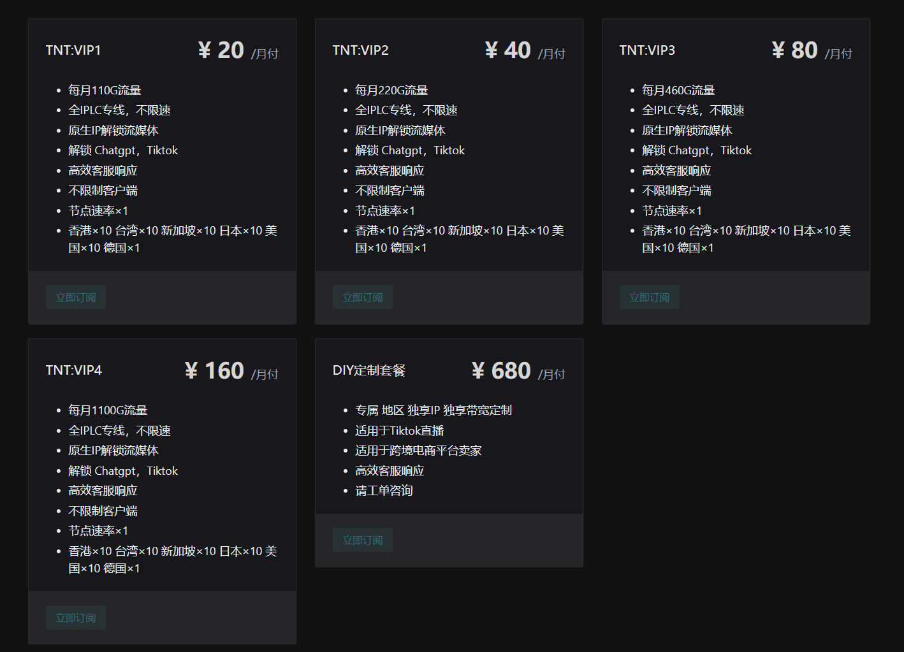
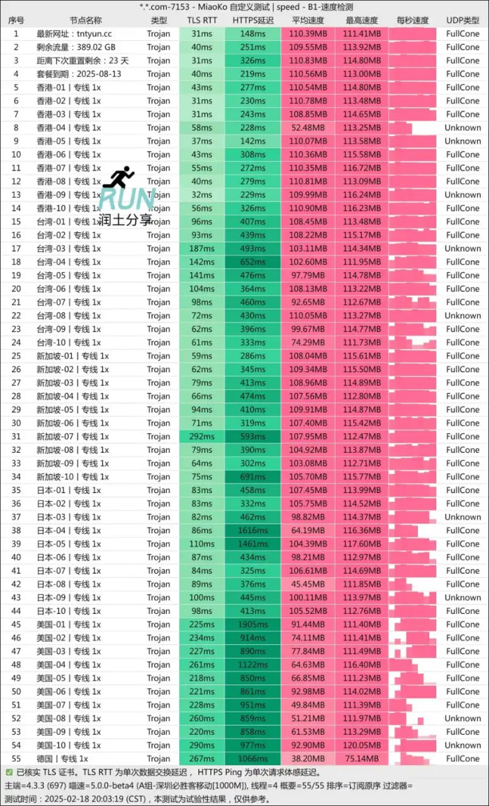

TNT机场现推出20元起享110G/月的超值套餐。作为新晋机场，TNT致力于提供优质的IPLC专线服务，确保用户畅享高速网络体验。

官网地址：[https://ermaozi01.tntvipaff.cc](https://ermaozi01.tntvipaff.cc/#/register?code=f1EyPwf3)

<!-- more -->

## TNT 注册入口

立即注册：[https://ermaozi01.tntvipaff.cc](https://ermaozi01.tntvipaff.cc/#/register?code=f1EyPwf3)

## TNT 机场介绍

享受每月110G流量仅需20元起，体验包括：
- 独享全IPLC专线，无限速限制
- 原生IP助力流媒体无障碍解锁
- 支持ChatGPT及TikTok的无缝访问
- 高效响应的客服团队
- 多平台客户端全面兼容

## TNT 机场性能展示

## 更多机场推荐
📌 **机场合集推荐**：[点击访问](https://www.pyjichang.com)

## 客户端使用教程

📱 **安卓**：[Clash for Android 使用指南](https://www.pyjichang.com/doc/eh8f4n86/)
🖥 **Windows**：[Clash for Windows 使用指南](https://www.pyjichang.com/doc/0gematwc/)
🍎 **iOS**：[Clash for iOS 使用指南](https://www.pyjichang.com/doc/z747kgjd/)

🚀 **选择合适的机场，让你的网络体验更顺畅！**