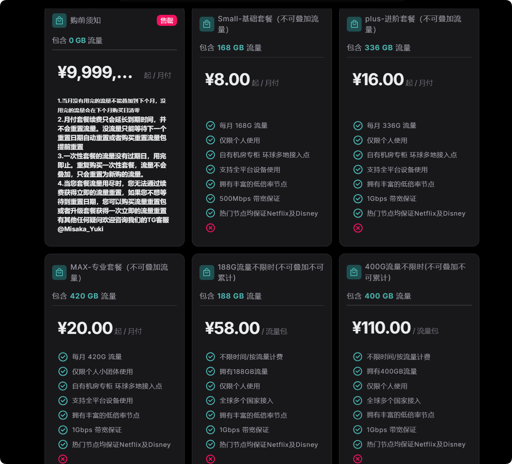
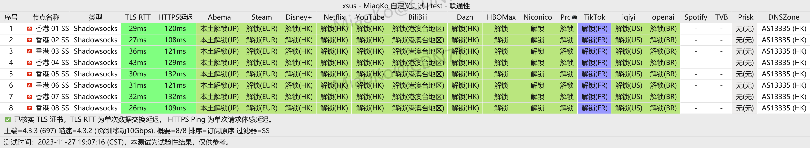
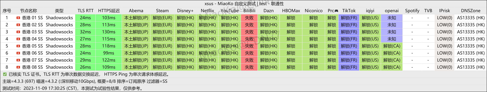

::: warning
2025年4月28日 XSUS 已触发跑路预警，不建议使用XSUS机场。
:::

<!-- more -->

## XSUS 官网地址

2025年4月28日 XSUS 已触发[跑路预警](https://www.pyjichang.com/scamvpn/mwk3l9oq/)，不建议使用XSUS机场。

## XSUS 机场简介

~~最便宜的订阅有8元 168G/月。~~

~~XSUS 机场是一家老牌机场，价格实惠，节点较多，节点质量也非常高，速度快，支持 Netflix、ChatGPT。~~

~~客服响应及时，强烈推荐这个机场。~~

## XSUS 机场测试

## 更多机场推荐

📌 **机场合集推荐**：[点击访问](https://www.pyjichang.com)

## 客户端使用教程

📱 **安卓**：[Clash for Android 使用指南](https://www.pyjichang.com/doc/eh8f4n86/)
🖥 **Windows**：[Clash for Windows 使用指南](https://www.pyjichang.com/doc/0gematwc/)
🍎 **iOS**：[Clash for iOS 使用指南](https://www.pyjichang.com/doc/z747kgjd/)

🚀 **选择合适的机场，让你的网络体验更顺畅！**