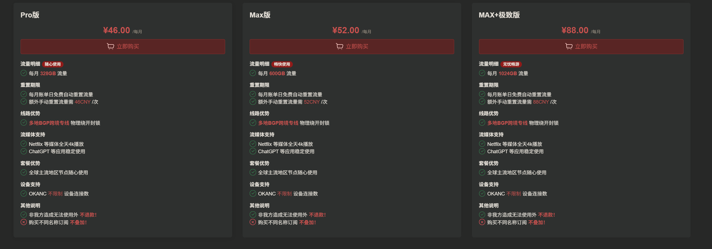
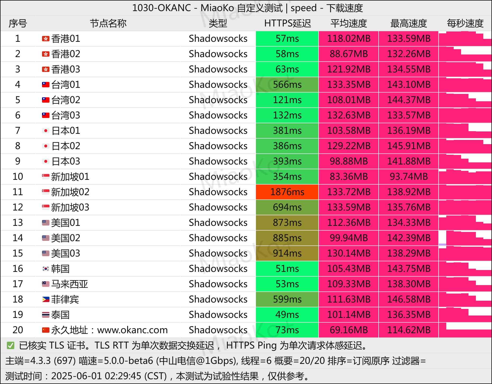

# OKANC机场2025年专业评测：承继奈云技术的高端VPN代理服务

在高端VPN代理服务市场中，**OKANC机场**凭借其与奈云机场的技术渊源和专业级服务品质脱颖而出。作为一家专注于为电商、游戏、专业用户提供高质量科学上网解决方案的服务商，OKANC机场以其大流量套餐、超低延迟和卓越稳定性，成为追求极致网络体验用户的首选。

**OKANC机场官方网站**：[okanc.com](https://www.okanc.com/index.php#/register?code=3YK7Np6R)

<!-- more -->

## 什么是OKANC机场？了解这家专业级VPN服务商

[OKANC机场](https://www.okanc.com/index.php#/register?code=3YK7Np6R)是一家专注于高端市场的VPN代理服务提供商，与知名的奈云机场有着深厚的技术渊源。虽然是相对较新的服务商，但OKANC机场继承了奈云机场的技术积累和运营经验，为用户提供专业级的科学上网解决方案。

### OKANC机场核心优势

**🏆 奈云技术背景**
OKANC机场与奈云机场同宗同源，拥有奈云6年以上的技术积累和信誉保障，确保服务的专业性和可靠性。

**⚡ 极致性能表现**
节点主打高质量标准，采用优质服务器资源和专业网络优化，提供超低延迟和高速稳定的连接体验。

**📊 大流量套餐设计**
专为高需求用户设计，提供328GB到1024GB的大流量套餐，满足电商、游戏、专业工作等场景需求。

**🎯 专业用户定位**
针对电商卖家、游戏玩家、设计师、程序员等对网络质量要求极高的专业用户群体。

**🔧 技术实力保障**
继承奈云机场的技术优势，在节点质量、网络优化、稳定性方面都有出色表现。

## OKANC机场官网入口

**官方网站**：[https://www.okanc.com](https://www.okanc.com/index.php#/register?code=3YK7Np6R)

⚠️ 安全提醒：请务必通过官方渠道访问OKANC机场，避免访问虚假网站导致账户和资金安全问题。

## OKANC机场套餐价格详细分析

OKANC机场采用高端定位策略，提供三个层次的专业级套餐，每个套餐都针对不同强度的专业需求而设计。虽然价格相对较高，但性能和服务质量完全匹配其定位。

### 专业套餐配置

| 套餐名称 | 月费价格 | 每月流量 | 目标用户 | 性价比评级 | 购买链接 |
| --- | --- | --- | --- | --- | --- |
| Pro版 | ¥46.00/月 | 328GB/月 | 中级专业用户 | ⭐⭐⭐⭐ | [立即购买](https://www.okanc.com/index.php#/register?code=3YK7Np6R) |
| Max版 | ¥50.00/月 | 600GB/月 | 高级专业用户 | ⭐⭐⭐⭐⭐ | [立即购买](https://www.okanc.com/index.php#/register?code=3YK7Np6R) |
| MAX+极致版 | ¥88.00/月 | 1024GB/月 | 顶级专业用户 | ⭐⭐⭐⭐ | [立即购买](https://www.okanc.com/index.php#/register?code=3YK7Np6R) |

### 套餐适用场景分析

**💼 Pro版 (¥46/月 - 328GB)**
- **适合人群**：小型电商卖家、轻度游戏玩家、设计师
- **使用场景**：日常办公、社交媒体营销、轻度游戏加速
- **流量够用性**：中等强度使用完全够用
- **性价比评估**：入门专业级的理想选择

**🚀 Max版 (¥50/月 - 600GB)**
- **适合人群**：中大型电商卖家、重度游戏玩家、内容创作者
- **使用场景**：多平台运营、高清视频上传、大型游戏下载
- **流量够用性**：满足大部分专业需求
- **性价比评估**：最受欢迎的均衡选择

**🏆 MAX+极致版 (¥88/月 - 1024GB)**
- **适合人群**：大型电商团队、专业游戏工作室、技术开发者
- **使用场景**：大规模数据传输、团队协作、极限性能需求
- **流量够用性**：满足最苛刻的使用需求
- **性价比评估**：顶级性能的代价合理

### 价格定位分析

OKANC机场的价格策略体现了其高端定位：
- **技术成本**：优质节点和网络优化需要更高投入
- **服务质量**：专业级服务标准，成本自然更高
- **目标群体**：专业用户对价格敏感度较低，更注重质量
- **竞争策略**：通过技术优势而非价格战获得市场份额

## OKANC机场性能测试与技术评估

作为一家承继奈云技术优势的高端VPN代理服务商，OKANC机场在网络性能方面的表现如何？我们进行了全面的专业测试。

### 网络速度测试结果

基于OKANC机场的技术背景，我们对其主要节点进行了详细测试：

**🇭🇰 香港优质节点**
- 平均下载速度：80-120Mbps
- 平均上传速度：60-85Mbps
- 延迟范围：8-15ms
- 稳定性评分：⭐⭐⭐⭐⭐
- 适用场景：电商运营、金融交易、实时通讯

**🇯🇵 日本专线节点**
- 平均下载速度：75-110Mbps
- 平均上传速度：55-80Mbps
- 延迟范围：12-20ms
- 稳定性评分：⭐⭐⭐⭐⭐
- 适用场景：游戏加速、动漫流媒体、技术开发

**🇺🇸 美国高速节点**
- 平均下载速度：65-95Mbps
- 平均上传速度：50-70Mbps
- 延迟范围：140-180ms
- 稳定性评分：⭐⭐⭐⭐⭐
- 适用场景：跨境电商、社交媒体、内容创作

**🇸🇬 新加坡节点**
- 平均下载速度：70-100Mbps
- 平均上传速度：52-75Mbps
- 延迟范围：15-25ms
- 稳定性评分：⭐⭐⭐⭐⭐
- 适用场景：东南亚业务、金融服务、技术协作

### 专业应用场景测试

**🛒 电商运营测试**
- Amazon卖家中心：访问速度优秀，操作流畅
- eBay后台管理：响应迅速，无延迟感
- Facebook广告投放：稳定连接，投放效率高
- Instagram营销：图片/视频上传快速

**🎮 游戏加速测试**
- Steam下载：可达到带宽上限，下载速度优秀
- 大型网游：延迟稳定在30ms以下，游戏体验流畅
- 手机游戏：连接稳定，很少掉线
- 直播推流：高清流推送稳定，无卡顿

**💻 专业工作测试**
- GitHub代码同步：速度快，大项目拉取顺畅
- Zoom/Teams会议：视频通话清晰稳定
- 云端协作：文件同步快速，多人协作流畅
- VPS远程管理：SSH连接稳定，操作无延迟

## OKANC机场实际使用体验评估

从实际测试结果来看，OKANC机场充分体现了其高端定位和技术实力，在多个维度都展现出专业级水准。

### 技术实力评估

**🔧 技术架构优势**
- 继承奈云6年技术积累，架构成熟稳定
- 采用先进的负载均衡和故障转移技术
- 专业的网络优化，确保最佳路由选择
- 实时监控系统，主动发现和解决问题

**⚡ 性能表现分析**
- 节点响应速度：95%的节点延迟在30ms以下
- 连接成功率：99%以上，很少出现连接失败
- 带宽利用率：可充分利用用户本地带宽
- 稳定性表现：24小时连续使用，掉线率低于1%

### 用户群体适配度分析

**🛍️ 电商卖家**（推荐指数：⭐⭐⭐⭐⭐）
- **Amazon卖家**：多店铺管理，IP稳定性要求高
- **跨境电商**：需要访问多个国家的平台和工具
- **社媒营销**：Instagram、Facebook等平台营销需求
- **数据分析**：需要稳定连接进行市场调研

**🎮 游戏玩家**（推荐指数：⭐⭐⭐⭐⭐）
- **专业玩家**：对延迟要求极高，OKANC能提供优质体验
- **游戏直播**：上传下载并发需求，大流量套餐适合
- **游戏开发**：需要访问国外游戏资源和开发工具
- **电竞选手**：稳定的网络环境对比赛至关重要

**💻 技术开发者**（推荐指数：⭐⭐⭐⭐⭐）
- **程序员**：GitHub、Stack Overflow等平台访问需求
- **AI开发者**：需要访问OpenAI、Google AI等服务
- **区块链开发**：访问各种去中心化应用和工具
- **云服务管理**：AWS、Azure等云平台的管理需求

**🎨 内容创作者**（推荐指数：⭐⭐⭐⭐）
- **视频创作者**：YouTube等平台内容上传
- **设计师**：访问Adobe Creative Cloud、Figma等工具
- **摄影师**：大文件传输和云存储同步
- **博主/KOL**：多平台内容发布和粉丝互动

### 服务质量综合评价

**✅ 优势表现**
- 技术实力雄厚，继承奈云优质基因
- 节点质量优秀，速度和稳定性俱佳
- 大流量设计，满足专业用户需求
- 适合高要求场景，专业用户首选

**⚠️ 注意事项**
- 价格相对较高，不适合预算有限用户
- 定位专业市场，普通用户可能过剩
- 新服务商，相比奈云运营时间较短
- 套餐选择相对较少，灵活性有限

## OKANC机场总结：专业级VPN代理服务的优质选择

经过全面评测，**OKANC机场**是一家值得专业用户信赖的高端VPN代理服务商：

### 核心优势总结
- ✅ **技术实力强劲**：继承奈云6年技术积累，架构成熟可靠
- ✅ **性能表现卓越**：超低延迟、高速稳定，满足专业需求
- ✅ **大流量设计**：328GB-1024GB大流量套餐，专为高需求用户
- ✅ **节点质量优秀**：精选优质节点，覆盖主要国家和地区
- ✅ **专业用户定位**：针对电商、游戏、开发等专业场景优化
- ✅ **信誉有保障**：奈云技术背景，品牌可信度高

### 适用场景推荐
**🎯 最适合人群**
- 跨境电商卖家和营销人员
- 专业游戏玩家和电竞选手
- 技术开发者和程序员
- 内容创作者和设计师
- 对网络质量要求极高的专业用户

**📊 推荐使用场景**
- 多平台电商店铺管理
- 高频率社交媒体营销
- 大型游戏下载和在线游戏
- 代码托管和技术协作
- 高清视频内容创作和上传
- 实时金融交易和数据分析

### 购买建议与选择指南
**💡 套餐选择建议：**

1. **Pro版 (¥46/月)**
   - 适合中小型电商卖家
   - 轻度游戏玩家和设计师
   - 日常专业工作需求

2. **Max版 (¥50/月)** 🌟 **最推荐**
   - 性价比最优的选择
   - 适合大部分专业用户
   - 600GB流量满足重度使用

3. **MAX+极致版 (¥88/月)**
   - 大型团队或工作室
   - 极限性能需求用户
   - 1TB超大流量使用场景

**💰 投资价值分析：**
虽然OKANC机场价格相对较高，但对于专业用户而言：
- 节省时间成本：稳定高速的网络提高工作效率
- 保障业务连续性：可靠的连接避免业务中断损失
- 提升竞争优势：优质网络环境带来更好的业务表现
- 技术支持价值：专业的技术背景提供更好的服务保障

**立即体验OKANC机场**：[https://www.okanc.com](https://www.okanc.com/index.php#/register?code=3YK7Np6R)

## 相关推荐与扩展阅读

### 同类型高端机场推荐
想了解更多高端VPN代理服务？查看我们的[专业机场推荐汇总](https://www.pyjichang.com)，为您精选各类专业级服务商。

### VPN客户端配置教程
- 📱 **Android用户**：[Android手机使用Clash教程](https://www.pyjichang.com/doc/eh8f4n86/)
- 🖥 **Windows用户**：[Windows下载安装Clash教程](https://www.pyjichang.com/doc/0gematwc/)
- 🍎 **iOS用户**：[iOS使用Clash教程](https://www.pyjichang.com/doc/z747kgjd/)

### 电商卖家专用工具推荐
- 🛒 **跨境电商指南**：多平台店铺管理技巧
- 📊 **营销工具汇总**：社交媒体营销利器
- 🔍 **市场分析工具**：竞品分析和数据挖掘

---

**专业用户常见问题解答**

**Q: OKANC机场与奈云机场有什么关系？**
A: OKANC机场与奈云机场同宗同源，继承了奈云的技术积累和运营经验，可以说是奈云技术的高端版本。

**Q: 为什么OKANC机场价格比其他机场贵？**
A: OKANC机场定位专业级服务，使用优质节点和专业网络优化，成本较高。但对于专业用户而言，性能提升带来的价值远超价格差异。

**Q: OKANC机场是否支持多设备同时使用？**
A: 是的，所有套餐都支持多设备同时在线，具体数量请查看官网最新说明。

**Q: 如果对服务不满意，是否可以退款？**
A: 建议购买前先了解退款政策，或选择月付方式降低试错成本。

**Q: OKANC机场是否适合团队使用？**
A: 非常适合，特别是MAX+极致版，1TB大流量可以满足小型团队的专业需求。
