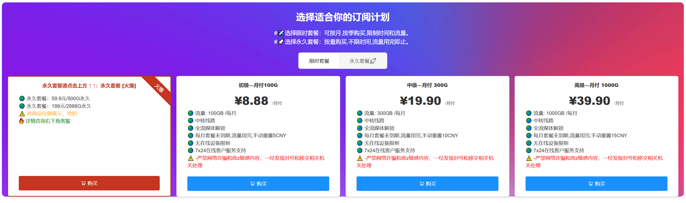
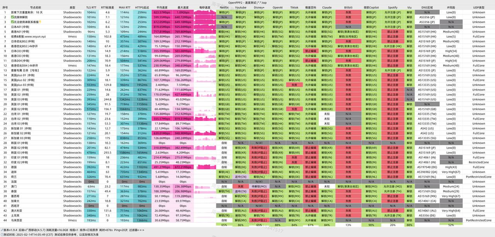

xx云加速是一款面向轻量用户的机场产品。虽然采用中转线路，但整体网速依然令人满意，同时具备低价实惠、全流媒体解锁以及无限设备接入等优点。

注册地址：[https://www.xxvip.shop](https://www.xxvip.shop/#/register?code=XQiZqbSr)

<!-- more -->

### xx云 机场简介

最低订购套餐为8.89元享100G流量。

[xx云加速](https://www.xxvip.shop/#/register?code=XQiZqbSr)定位为轻量级机场，虽使用中转线路，但速度依然出色，加上价格亲民、流媒体全面支持以及无限设备接入，非常适合偶尔在外网看片或查资料的用户。

由于现阶段用户基数较小，建议先行试用一段时间。不过， **强烈建议按月订购** ，以降低意外风险。

### xx云 机场测试

## 机场汇总

[https://www.pyjichang.com/](https://www.pyjichang.com/)

## 客户端使用方法

- 📱 [clash for Android](https://www.pyjichang.com/doc/eh8f4n86/)
- 🖥 [clash for Windows](https://www.pyjichang.com/doc/0gematwc/)
- 🍎 [clash for iOS](https://www.pyjichang.com/doc/z747kgjd/)