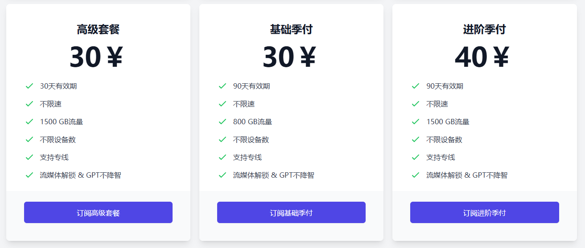
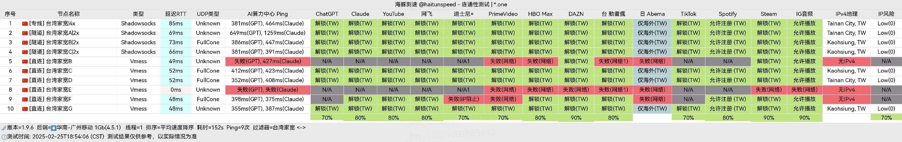
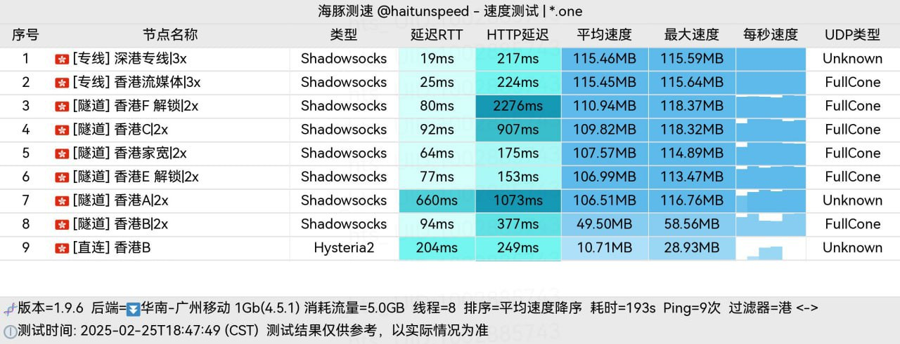
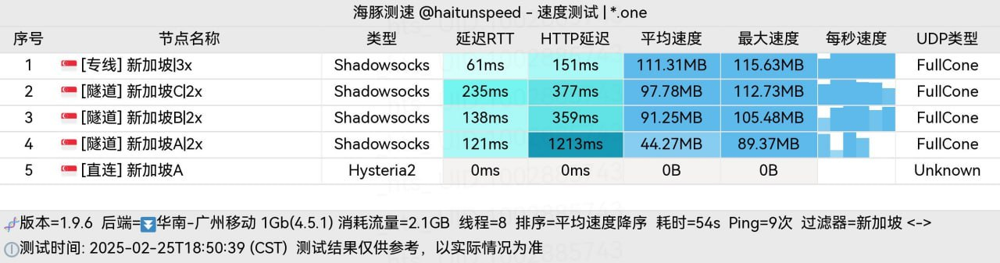
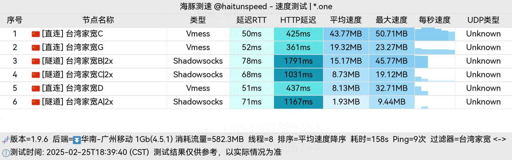
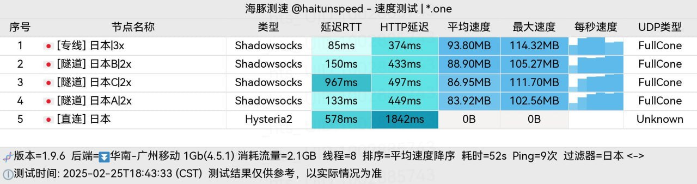

## 冲上云霄机场推荐

**冲上云霄**是一家自主研发的平台，采用台湾家宽，具备晚高峰BGP自动切换入口，并配备三网专线，确保网络稳定。值得一提的是，GPT体验不降智，同时，累计消费越高，折扣力度越大，最高可享受七五折优惠。

💡 **专属优惠码**：`ermaozi`，购买套餐后输入可额外获取 **20G** 流量。

🔗 **注册地址**：[点击这里](https://cpdd.one/?r=32083)

---

## 机场介绍

[冲上云霄](https://cpdd.one/?r=32083)是一款专为稳定科学上网打造的平台，核心优势包括：

- **自主研发**，优化传输体验
- **台湾家宽**，高速低延迟
- **BGP智能切换**，晚高峰也能流畅使用
- **三网专线**，无惧网络拥堵
- **支持GPT**，无降智困扰

🎉 **性价比超高**：最低套餐仅 **5元**，即可享受 **80G/30天** 的流量。

📌 **更多价格详情**：

---

## 机场测速

### 🌍 流媒体解锁情况

### 📍 各地区节点测试
#### 香港

#### 新加坡

#### 台湾

#### 日本

---

## 更多机场推荐
📌 **机场合集推荐**：[点击访问](https://www.pyjichang.com)

---

## 客户端使用教程

📱 **安卓**：[Clash for Android 使用指南](https://www.pyjichang.com/doc/eh8f4n86/)
🖥 **Windows**：[Clash for Windows 使用指南](https://www.pyjichang.com/doc/0gematwc/)
🍎 **iOS**：[Clash for iOS 使用指南](https://www.pyjichang.com/doc/z747kgjd/)

🚀 **选择合适的机场，让你的网络体验更顺畅！**

