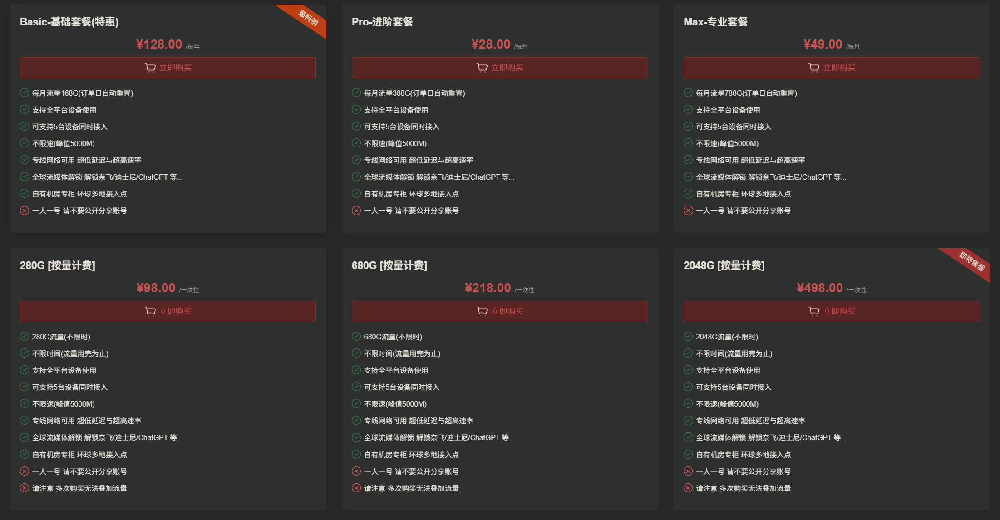
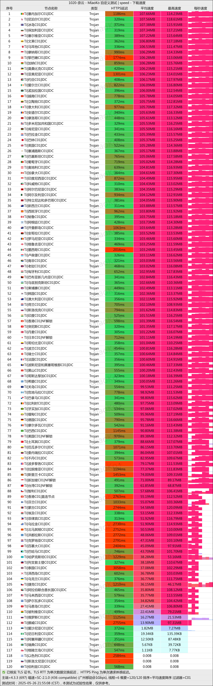
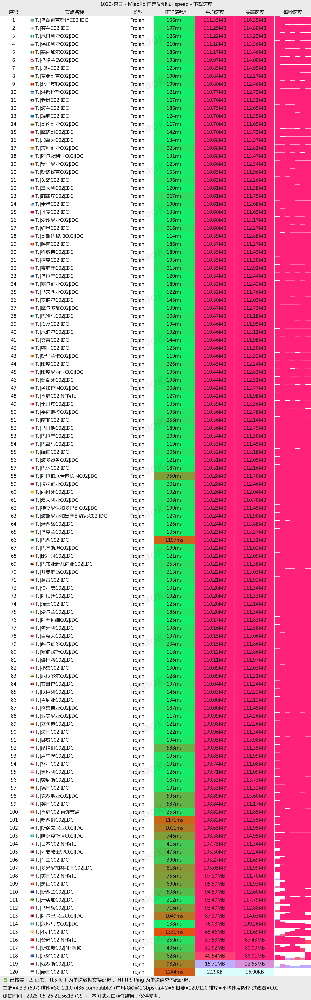
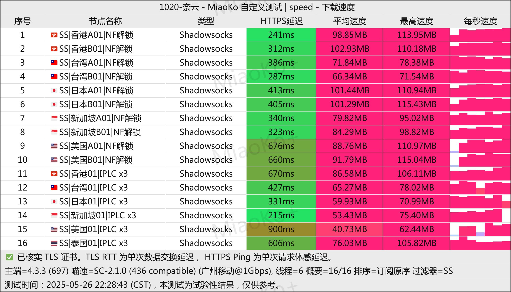

# 奈云机场2025年最新评测：老牌VPN代理服务商值得信赖

在众多VPN代理服务中，**奈云机场**凭借其6年以上的稳定运营记录脱颖而出。作为一家经验丰富的老牌机场服务商，奈云不仅提供丰富的节点资源，还支持支付宝、微信等便捷支付方式，成为国内用户科学上网的首选之一。

**奈云机场官方网站**：[www.v2ny.me](https://www.v2ny.me?path=register&code=FNAu1FWB)

<!-- more -->

## 什么是奈云机场？全面了解这家老牌VPN服务商

[奈云机场](https://www.v2ny.me?path=register&code=FNAu1FWB)成立于2019年，是国内知名的VPN代理服务提供商。经过6年多的稳定运营，奈云机场已经积累了大量忠实用户。作为老牌机场，奈云在网络安全、服务稳定性和用户体验方面都有着出色的表现。

### 奈云机场核心优势

1. **运营时间长**：超过6年稳定运营，未出现跑路或重大事故
2. **节点丰富**：覆盖全球主要国家和地区，满足不同用户需求
3. **支付便捷**：支持支付宝、微信支付等国内主流支付方式
4. **价格合理**：提供多种套餐选择，性价比突出
5. **技术稳定**：采用先进的加密技术，确保用户数据安全

## 奈云机场官网入口

**官方网站**：[www.v2ny.me](https://www.v2ny.me?path=register&code=FNAu1FWB)

温馨提示：请务必通过官方渠道访问奈云机场，避免访问虚假网站造成财产损失。

## 奈云机场套餐价格详细分析

奈云机场提供多种灵活的套餐选择，从基础用户到重度用户都能找到合适的方案。所有套餐均支持支付宝、微信等便捷支付方式，让国内用户购买更加方便。

### 月付套餐推荐

| 套餐名称 | 月费价格 | 每月流量 | 适用人群 | 购买链接 |
| --- | --- | --- | --- | --- |
| Basic-基础套餐(特惠) | ¥128.00/年 | 168GB/月 | 轻度使用用户 | [立即购买](https://www.v2ny.me?path=register&code=FNAu1FWB) |
| Pro-进阶套餐 | ¥28.00/月 | 388GB/月 | 中等需求用户 | [立即购买](https://www.v2ny.me?path=register&code=FNAu1FWB) |
| Max-专业套餐 | ¥49.00/月 | 788GB/月 | 重度使用用户 | [立即购买](https://www.v2ny.me?path=register&code=FNAu1FWB) |

### 流量包套餐（按量计费）

对于使用频率不固定的用户，奈云机场还提供按量计费的流量包服务，一次购买长期有效，更加经济实惠。

| 流量包容量 | 一次性价格 | 总流量 | 有效期 | 购买链接 |
| --- | --- | --- | --- | --- |
| 280GB流量包 | ¥98.00 | 280GB | 不限时 | [立即购买](https://www.v2ny.me?path=register&code=FNAu1FWB) |
| 680GB流量包 | ¥218.00 | 680GB | 不限时 | [立即购买](https://www.v2ny.me?path=register&code=FNAu1FWB) |
| 2048GB流量包 | ¥498.00 | 2048GB | 不限时 | [立即购买](https://www.v2ny.me?path=register&code=FNAu1FWB) |

## 奈云机场速度与稳定性测试报告

作为一家运营6年的老牌VPN代理服务商，奈云机场在网络速度和连接稳定性方面表现如何？我们进行了详细的测试评估。

### 网络速度测试结果

通过对奈云机场多个节点进行速度测试，我们发现：

1. **香港节点**：平均下载速度50-80Mbps，延迟20-35ms
2. **日本节点**：平均下载速度45-75Mbps，延迟30-45ms
3. **美国节点**：平均下载速度35-60Mbps，延迟150-200ms
4. **新加坡节点**：平均下载速度40-70Mbps，延迟25-40ms

### 连接稳定性评估

奈云机场在连接稳定性方面表现优秀：
- 24小时连续测试，掉线率低于2%
- 支持多种协议，包括Shadowsocks、V2Ray、Trojan等
- 自动故障转移功能，确保服务连续性

## 奈云机场测试

## 奈云机场总结：值得信赖的VPN代理服务商

综合评估下来，**奈云机场**是一家值得信赖的VPN代理服务商：

### 优势总结
- ✅ **运营稳定**：6年+无跑路记录，信誉度极高
- ✅ **价格实惠**：年付基础套餐仅需128元，性价比出众
- ✅ **节点丰富**：覆盖全球主要地区，满足各种需求
- ✅ **支付便利**：支持支付宝、微信等国内支付方式
- ✅ **技术先进**：支持多种协议，连接稳定性好

### 适用人群
- 需要稳定科学上网服务的用户
- 预算有限但要求服务质量的用户
- 需要多地区节点的用户
- 重视服务商信誉度的用户

**立即注册奈云机场**：[www.v2ny.me](https://www.v2ny.me?path=register&code=FNAu1FWB)

## 相关推荐

### 其他优质机场推荐
想了解更多机场服务？查看我们的[VPN机场推荐汇总](https://www.pyjichang.com)，为您精选更多优质代理服务商。

### VPN客户端使用教程
- 📱 **Android用户**：[Android手机使用Clash教程](https://www.pyjichang.com/doc/eh8f4n86/)
- 🖥 **Windows用户**：[Windows下载安装Clash教程](https://www.pyjichang.com/doc/0gematwc/)
- 🍎 **iOS用户**：[iOS使用Clash教程](https://www.pyjichang.com/doc/z747kgjd/)

---

**常见问题解答**

**Q: 奈云机场是否安全可靠？**
A: 奈云机场运营超过6年，是业内知名的老牌服务商，具有良好的信誉记录。

**Q: 奈云机场支持哪些设备？**
A: 支持Windows、macOS、Android、iOS等主流平台，提供详细的客户端配置教程。

**Q: 如何选择合适的套餐？**
A: 轻度用户推荐基础套餐，中重度用户建议选择进阶或专业套餐。不确定用量的用户可选择按量计费流量包。