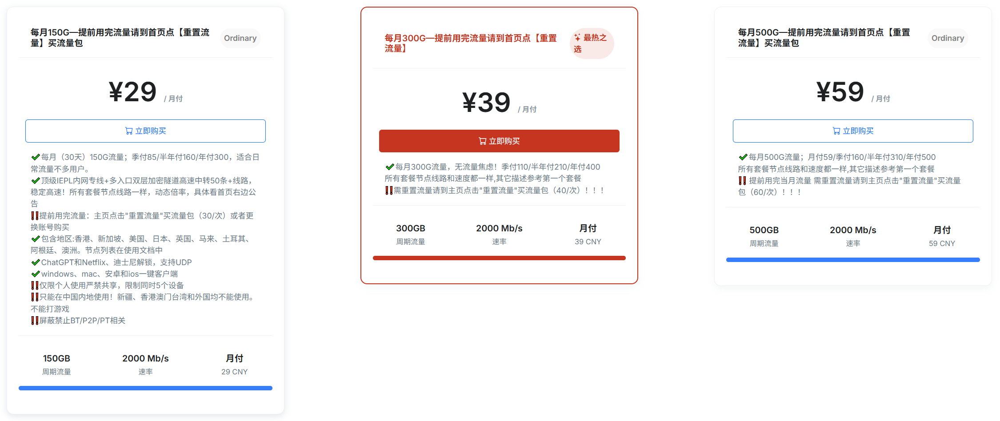
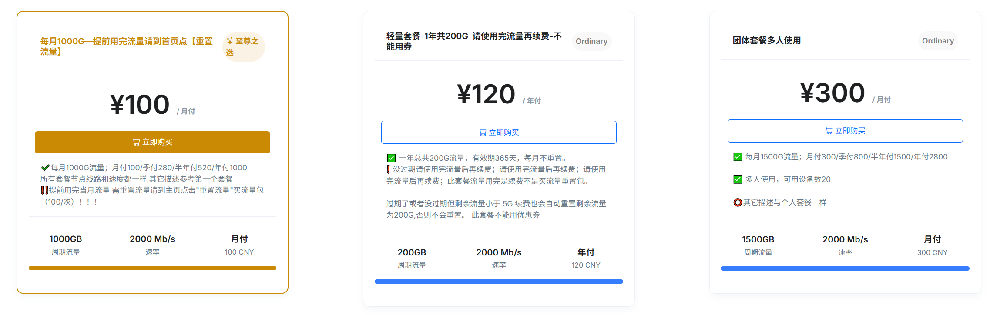
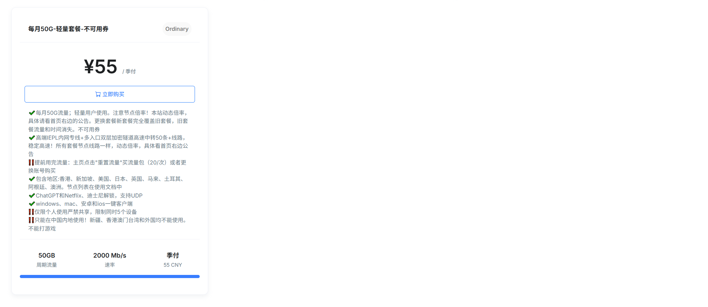
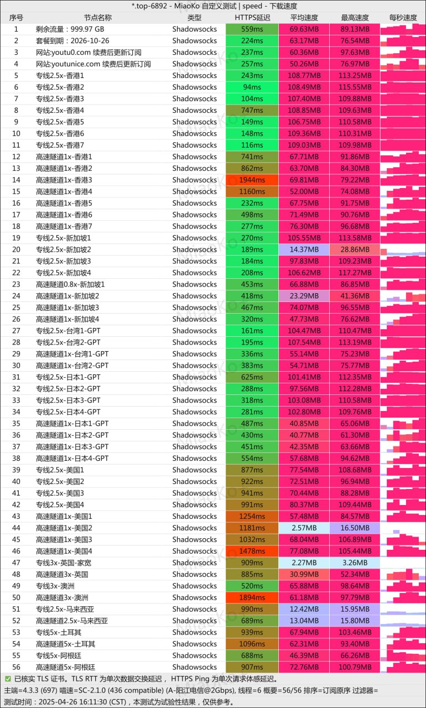

悠兔官网地址：[https://youtu7.shop](https://youtu7.shop/register?aff=kcXosGca)

<!-- more -->

## 悠兔官网地址

[https://youtu7.shop](https://youtu7.shop/register?aff=kcXosGca)

## 悠兔机场简介

[悠兔](https://youtu7.shop/register?aff=kcXosGca)跨境专线，畅享全球网络无缝连接。

## 悠兔最新套餐价格（2026-04 更新）

> 以下文字价格为最新口径，若与上方历史截图不一致，以本节为准。

| 套餐 | 价格 |
| --- | --- |
| 每月150G | ¥39/月；¥110/季；¥210/半年；¥400/年 |
| 每月300G | ¥59/月；¥160/季；¥310/半年；¥500/年 |
| 每月500G | ¥79/月；¥220/季；¥420/半年；¥800/年 |
| 每月1000G | ¥119/月；¥350/季；¥650/半年 |
| 每月1500G团体套餐 | ¥366/月；¥880/季 |
| 每月50G | ¥79/季；¥155/半年；¥300/年 |
| 轻量一年共200G | ¥199/年 |

## 悠兔机场测速

## 机场汇总

[https://www.pyjichang.com](https://www.pyjichang.com)

## 客户端使用方法

- 📱 [clash for Android](https://www.pyjichang.com/doc/eh8f4n86/)
- 🖥 [clash for Windows](https://www.pyjichang.com/doc/0gematwc/)
- 🍎 [clash for iOS](https://www.pyjichang.com/doc/z747kgjd/)