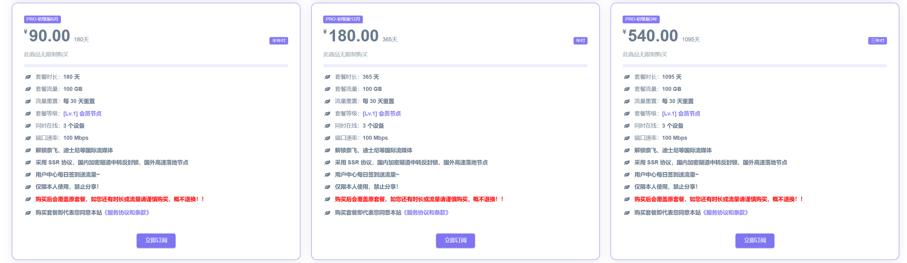

自2020年起，百变小樱以其低调却可靠的服务稳步运营。团队现已海外部署，从而彻底规避了按流量计费的隐患。平台以线路的稳定性、全平台流媒体解锁、极具竞争力的价格以及赠送流媒体账号这几大优势深受用户信赖。

【百变小樱】优惠信息：
- 半年订阅享95折优惠：`happy10-1-6month`
- 年度计划享88折优惠：`happy10-1-1year`
- 三年套餐享78折优惠：`happy10-1-3years`

点击访问注册地址：[https://bbxy88.com](https://bbxy.xn--cesw6hd3s99f.com/auth/register?code=WuuD)

<!-- more -->

### 机场服务简介

入门级套餐仅需15元即可享受100G数据，服务周期为30天。

【[百变小樱](https://bbxy.xn--cesw6hd3s99f.com/auth/register?code=WuuD)】再次提供：
- 半年订阅：95折优惠码 `happy10-1-6month`
- 年订阅：88折优惠码 `happy10-1-1year`
- 三年订阅：78折优惠码 `happy10-1-3years`

[百变小樱](https://bbxy.xn--cesw6hd3s99f.com/auth/register?code=WuuD)通过隧道与专线的双重架构，确保线路运行始终稳定，同时配备了经过高度定制的简洁面板，避免了节点信息冗杂的问题。平台支持SSR系列代理软件，如小火箭与Clash，为用户带来更流畅的体验。支付方式涵盖支付宝、微信支付与USDT，满足不同用户的需求。

### 机场性能测试

## 更多机场推荐
📌 **机场合集推荐**：[点击访问](https://www.pyjichang.com)

## 客户端使用教程

📱 **安卓**：[Clash for Android 使用指南](https://www.pyjichang.com/doc/eh8f4n86/)
🖥 **Windows**：[Clash for Windows 使用指南](https://www.pyjichang.com/doc/0gematwc/)
🍎 **iOS**：[Clash for iOS 使用指南](https://www.pyjichang.com/doc/z747kgjd/)

🚀 **选择合适的机场，让你的网络体验更顺畅！**