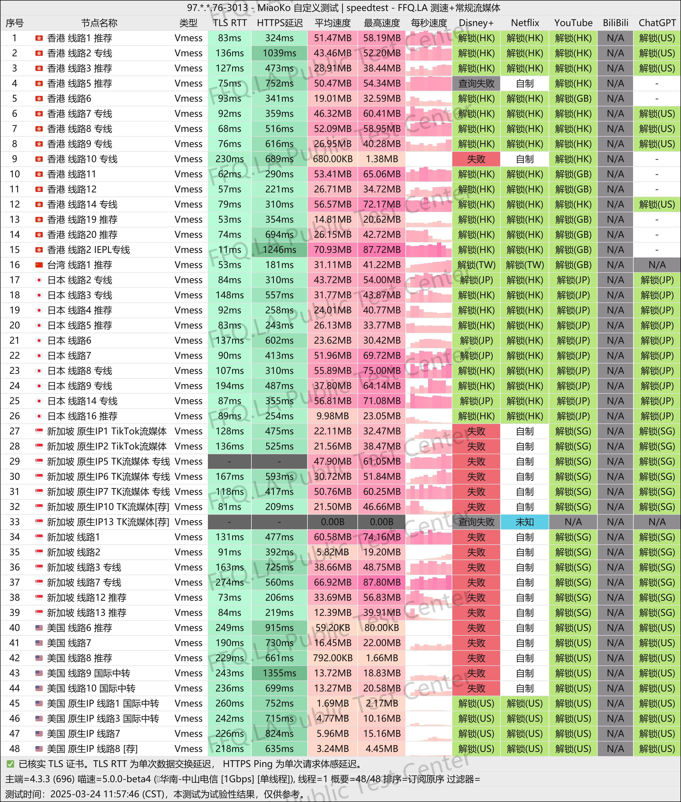

如果你在寻找一个长期靠谱、速度稳定的科学上网服务商，那一定不能错过**老头VPN**。

老头VPN机场从 **2016年开始运营**，是圈内公认的老牌服务商，质量稳定、体验优秀。**基础套餐只要 15.5 元/月，包含 150G 流量**，非常适合日常使用。

🌐 **老头VPN官网地址**：
👉 [https://www.chattous.net](https://www.chattous.net/register?code=3OWtZ9Bi)

<!-- more -->

## 🚀 老头VPN机场简介

- 💰 **价格实惠**：最低套餐 15.5 元/月，150G 流量，性价比很高
- 📅 **运营时间久**：自 2016 年起稳定运营，老用户众多
- 🎬 **流媒体解锁**：支持 Netflix、YouTube、Disney+ 等常见平台
- 👨‍💻 **客服靠谱**：响应速度快，专业程度在线
- 🌍 **接入速度快**：单线带宽高达 2Gbps，访问国外网站几乎无压力

📌 注册直达链接：
👉 [https://www.chattous.net/register?code=3OWtZ9Bi](https://www.chattous.net/register?code=3OWtZ9Bi)

## 💰 老头VPN套餐价格图

## 📊 老头VPN测速图

测速表现优秀，延迟低、速度稳，适合刷剧、远程工作或打游戏：

## 🧩 客户端下载汇总

- 📱 [Clash for Android 下载](https://www.pyjichang.com/doc/eh8f4n86/)
- 🖥 [Clash for Windows 下载](https://www.pyjichang.com/doc/0gematwc/)
- 🍎 [Clash for iOS 下载](https://www.pyjichang.com/doc/z747kgjd/)

## 🧭 更多便宜机场推荐

👉 [https://www.pyjichang.com](https://www.pyjichang.com)

---

**老头VPN** 是非常适合做主力机场的服务商，不花哨但够稳、够快，尤其适合对节点质量和服务稳定性有要求的用户。

👀 想体验下？
📌 快速注册通道：
👉 [https://www.chattous.net/register?code=3OWtZ9Bi](https://www.chattous.net/register?code=3OWtZ9Bi)
