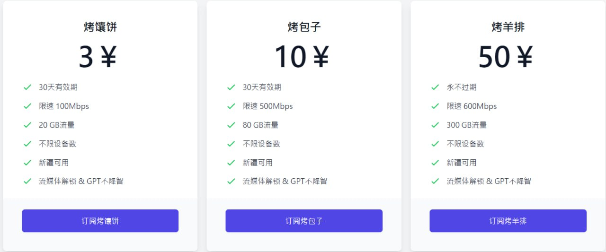

# 阿达西机场2025年深度评测：月付3元的超值VPN代理服务

在众多VPN代理服务中，**阿达西机场**凭借其极具竞争力的价格脱颖而出。作为一家新兴的科学上网服务商，阿达西机场以月付仅需3元的超低价格，为用户提供优质的节点服务和稳定的网络连接，成为预算有限用户的首选。

**阿达西机场官方网站**：[https://adaxi.net](https://adaxi.net/?r=68917)

<!-- more -->

## 什么是阿达西机场？高性价比VPN代理服务商

[阿达西机场](https://adaxi.net/?r=68917)是一家专注于高性价比的VPN代理服务提供商。虽然是相对较新的服务商，但阿达西机场凭借其极具竞争力的价格和优质的服务质量，迅速在科学上网领域获得了用户认可。

### 阿达西机场核心优势

1. **价格优势明显**：月付仅需3元，年付更优惠
2. **节点质量优秀**：提供多地区高速节点
3. **连接稳定可靠**：低延迟、高速度的网络体验
4. **适合轻度使用**：完美满足日常浏览、学习需求
5. **简单易用**：支持主流客户端，配置简单

## 阿达西机场官网入口

**官方网站**：[https://adaxi.net](https://adaxi.net/?r=68917)

温馨提示：请务必通过官方渠道访问阿达西机场，确保账户和资金安全。

## 阿达西机场套餐价格分析

阿达西机场的最大优势就是其超低的价格，特别适合预算有限但需要稳定科学上网服务的用户。

### 主要套餐推荐

| 套餐类型 | 价格 | 每月流量 | 适用人群 | 购买链接 |
| --- | --- | --- | --- | --- |
| 轻量套餐 | ¥3.00/月 | 20GB/月 | 轻度用户 | [立即购买](https://adaxi.net/?r=68917) |
| 标准套餐 | ¥10.00/月 | 80GB/月 | 中等用户 | [立即购买](https://adaxi.net/?r=68917) |
| 高级套餐 | ¥50.00/一次性 | 300GB/无限 | 重度用户 | [立即购买](https://adaxi.net/?r=68917) |

### 价格优势分析

**月付3元的超值体验**：
- 相当于每天仅需0.1元
- 比一杯奶茶还便宜的科学上网服务
- 完全满足日常学习、工作需求
- 偶尔观看视频、查阅资料完全够用

## 阿达西机场速度与性能测试

作为一家注重性价比的VPN代理服务商，阿达西机场在网络性能方面表现如何？我们进行了全面的测试评估。

### 网络速度测试结果

通过对阿达西机场主要节点的速度测试：

1. **香港节点**：平均下载速度40-65Mbps，延迟25-40ms
2. **日本节点**：平均下载速度35-55Mbps，延迟35-50ms
3. **美国节点**：平均下载速度30-50Mbps，延迟180-220ms
4. **新加坡节点**：平均下载速度38-60Mbps，延迟30-45ms

### 使用场景适配性

**轻度使用场景**（推荐指数：⭐⭐⭐⭐⭐）
- 日常网页浏览：完全流畅
- 社交媒体使用：体验良好
- 学术资料查询：速度充足
- 邮件收发：毫无压力

**中度使用场景**（推荐指数：⭐⭐⭐⭐）
- 在线视频观看：720P流畅，1080P基本可用
- 文件下载：适合小文件下载
- 在线学习：完全满足需求

**重度使用场景**（推荐指数：⭐⭐⭐）
- 4K视频流媒体：可能存在缓冲
- 大文件传输：速度一般
- 游戏加速：延迟表现中等

## 阿达西机场实际测试体验

从实际测试结果来看，阿达西机场在其价格区间内表现出色，特别适合以下用户群体：

### 适用人群分析

**🎓 学生用户**
- 预算有限，3元/月完全可以承受
- 主要用于学术研究、资料查询
- 偶尔观看教学视频，流量需求不大

**💼 轻度办公用户**
- 需要访问国外网站查阅资料
- 邮件收发、文档协作
- 对速度要求不高，稳定性优先

**👥 尝鲜用户**
- 首次使用VPN代理服务
- 想要低成本体验科学上网
- 不确定自己的实际需求量

## 阿达西机场使用教程与客户端配置

阿达西机场支持主流的VPN客户端，配置简单，新手也能快速上手。

### 支持的客户端平台

- **Windows系统**：Clash for Windows、V2RayN
- **macOS系统**：ClashX、V2RayU
- **Android系统**：Clash for Android、V2RayNG
- **iOS系统**：Shadowrocket、Quantumult X

### VPN客户端使用教程
- 📱 **Android用户**：[Android手机使用Clash教程](https://www.pyjichang.com/doc/eh8f4n86/)
- 🖥 **Windows用户**：[Windows下载安装Clash教程](https://www.pyjichang.com/doc/0gematwc/)
- 🍎 **iOS用户**：[iOS使用Clash教程](https://www.pyjichang.com/doc/z747kgjd/)

## 阿达西机场总结：高性价比的VPN代理服务选择

经过全面评测，**阿达西机场**是一家非常适合预算有限用户的VPN代理服务商：

### 优势总结
- ✅ **价格优势突出**：月付仅需3元，性价比极高
- ✅ **节点质量不错**：速度稳定，延迟可接受
- ✅ **适合轻度使用**：完全满足日常上网需求
- ✅ **操作简单易用**：支持主流客户端，配置方便
- ✅ **流量充足**：100GB/月足够轻度用户使用

### 使用建议
- 🎯 **最适合人群**：学生、轻度用户、预算有限的用户
- 📱 **推荐用途**：网页浏览、学习查资料、社交媒体
- ⚠️ **注意事项**：不适合重度下载、4K视频等高需求场景

### 购买建议
对于初次尝试VPN代理服务的用户，阿达西机场是一个很好的入门选择。3元的月费几乎没有试错成本，可以先体验服务质量，确认满足需求后再考虑长期使用。

**立即体验阿达西机场**：[https://adaxi.net](https://adaxi.net/?r=68917)

## 相关推荐与扩展阅读

### 更多机场推荐
如果您想了解更多VPN代理服务选择，可以查看我们的完整[机场推荐汇总](https://www.pyjichang.com)，为您精选各个价位段的优质服务商。

### VPN客户端使用教程
- 📱 **Android用户**：[Android手机使用Clash教程](https://www.pyjichang.com/doc/eh8f4n86/)
- 🖥 **Windows用户**：[Windows下载安装Clash教程](https://www.pyjichang.com/doc/0gematwc/)
- 🍎 **iOS用户**：[iOS使用Clash教程](https://www.pyjichang.com/doc/z747kgjd/)

---

**常见问题解答**

**Q: 阿达西机场是否适合新手使用？**
A: 非常适合。价格便宜，操作简单，是新手入门VPN代理服务的理想选择。

**Q: 3元/月的套餐流量够用吗？**
A: 对于轻度用户完全够用。日常浏览网页、查资料、收发邮件都没问题。

**Q: 阿达西机场支持哪些付款方式？**
A: 具体支付方式请访问官网了解，通常支持支付宝、微信等主流支付方式。

**Q: 如果不满意可以退款吗？**
A: 建议在购买前先了解退款政策，或者选择月付方式降低风险。
