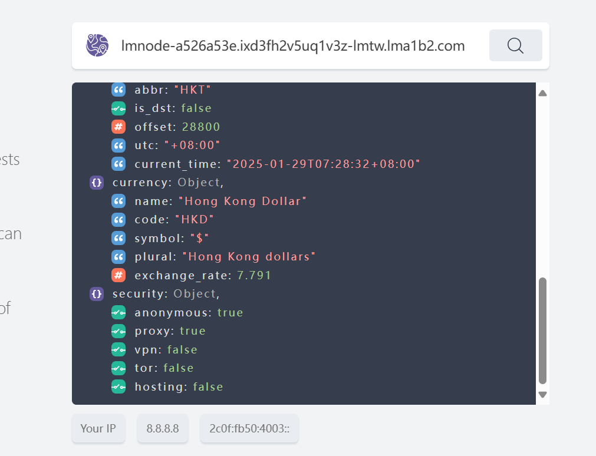
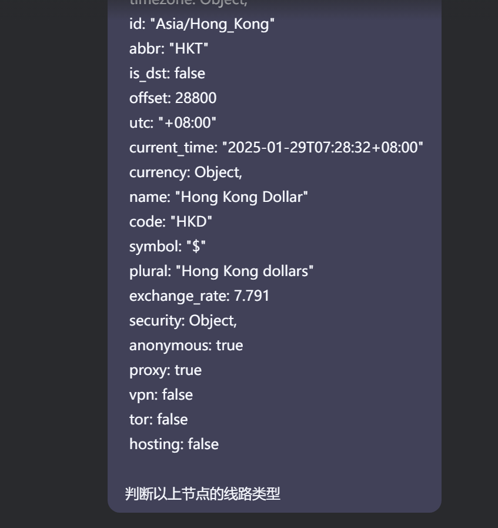
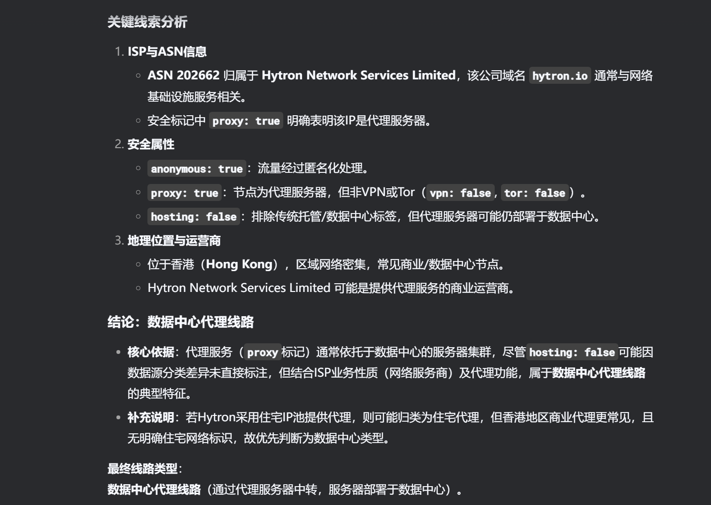

感谢网友[@wannaCSmajor](https://github.com/wannaCSmajor)的提问：

> 猫哥，我看有种说法是：“选购机场时，主要是看线路，其次才是节点数量，尽量选择IPLC/IEPL内网专线、BGP多入口中转（总体线路质量：华为云内网专线>IEPL内网专线>CN2>普通公网普通中转），在保证能流畅看视频前提下，稳定性最重要，其次才是速度”，请问怎么才能知道一个机场用的线路种类呢？

要准确判断一个机场使用的线路类型（如IPLC/IEPL专线、CN2、BGP中转等），需要通过技术手段结合实际测试综合验证。以下是具体方法和步骤

<!-- more -->

## **一、基础判断：官方信息与用户反馈**
### 1. **查看机场宣传**
   - 直接阅读机场官网的「线路介绍」，专业机场会明确标注 **IPLC/IEPL专线、BGP多入口、CN2 GIA** 等关键词。
   - 警惕模糊表述（如「高端中转」「企业级优化」），此类可能是普通公网中转。

### 2. **用户社群验证**
   - 在Reddit、Telegram群组或技术论坛搜索该机场名称，观察用户反馈的 **高峰时段稳定性、延迟波动** 等特征。

---

## **二、技术检测：路由与IP分析**
### 1. **Traceroute路由追踪**
   - 使用 `tracert`（Windows）或 `traceroute`（Linux/macOS）命令，观察数据包路径：
     - **IPLC/IEPL专线**：路径极简（通常为 `国内跳点 → 境外入口IP`，中间无公网节点）。
     - **CN2 GIA**：路径中出现 `59.43.x.x`（CN2骨干网IP）。  
     - **普通中转**：路径复杂，经过多个公网节点（如202.97、AS4134等电信163网络）。

   ```bash
   traceroute your-ss-server.com
   ```

   如果没有安装 `traceroute`，可以使用在线工具 [Traceroute Online](https://www.traceroute-online.com/)。

### 2. **检查入口/出口IP归属**
   - 通过 [IP.SB](https://ip.sb) 查询服务器IP：
     - **IPLC/IEPL**：入口IP为国内（如上海、广州），出口IP为境外（如香港、日本），但延迟低于30ms。
     - **BGP中转**：入口IP可能属于阿里云、腾讯云等国内云服务商。
     - **普通公网**：出口IP为境外数据中心（如HE.NET、Psychz）。

### 3. **ASN（自治系统号）验证**
   - CN2线路的ASN为 **AS4809**，普通电信163网络为 **AS4134**。使用以下命令查看：
     ```bash
     whois -h whois.radb.net YOUR_IP | grep origin
     ```
    
    如果没有安装 `whois`，可以使用在线工具 [IPWHOIS](https://www.ipwhois.io/)。
---

## **三、性能测试：延迟与稳定性**
### 1. **高峰时段丢包率测试**  
   - 在晚高峰（20:00-22:00）使用 `ping` 或 [MTR工具](https://github.com/traviscross/mtr) 持续测试：
     - **IPLC/IEPL**：丢包率通常低于1%，延迟稳定（如香港→上海约20ms）。
     - **CN2 GIA**：丢包率约2-5%，延迟40-60ms。
     - **普通线路**：丢包率可能超过10%，延迟波动大。

### 2. **跨境速度测试**  
   - 使用 [SpeedTest](https://www.speedtest.net/) 选择境外节点（如洛杉矶、新加坡）：
     - **专线/CN2**：晚高峰下载速度≥50Mbps。
     - **普通线路**：速度可能骤降至10Mbps以下。

---

## **四、高级工具：协议与流量特征**
### 1. **抓包分析协议**
   - 使用 Wireshark 抓包，观察流量特征：
     - **IPLC/IEPL**：数据包直接指向境外IP，无NAT转换痕迹。
     - 中转线路：可能出现多层TCP封装或协议混淆。

### 2. **Looking Glass工具**  
   - 部分机场提供 [Looking Glass](https://en.wikipedia.org/wiki/Looking_Glass_servers) 服务，可实时查看路由状态。

---

## **五、典型线路特征总结**
| 线路类型         | 延迟（国内→境外） | 跳数 | 高峰丢包率 | 典型IP/ASN                 |
|------------------|------------------|------|------------|----------------------------|
| IPLC/IEPL专线    | 10-30ms          | 3-5  | <1%        | 入口IP属国内，出口IP境外   |
| CN2 GIA          | 40-70ms          | 8-12 | 2-5%       | 59.43.x.x (AS4809)         |
| BGP多入口中转    | 50-100ms         | 6-10 | 3-8%       | 阿里云/腾讯云IP (AS37963)  |
| 普通公网中转     | 80-200ms         | >12  | >10%       | 202.97.x.x (AS4134)        |

## **六、最简单的办法：让AI去测**

现在都是大 AI 时代了，以上的手动方法虽然浪漫，但需要一定门槛，不如直接拿到节点信息然后让 AI 来判断该节点类型。

先去[https://ipwhois.io/](https://ipwhois.io/)拿到节点信息.



然后直接让 AI 来判断，这样更快更准确。





以上 AI 使用的是[deepseek](https://chat.deepseek.com/)，国内可以流畅访问。

---

## **注意事项**
1. **伪装线路识别**：部分机场会通过「入口IP NAT转发」伪装成专线，需结合延迟和跳数判断。  
2. **动态路由影响**：BGP线路可能因运营商调度切换路径，需多次测试。  
3. **成本关联**：IPLC/IEPL价格极高（约$50/Mbps/月），若机场套餐极低价，则大概率非真专线。
4. **AI判断准确性**：AI判断结果仅供参考，仍需结合实际测试综合判断。

通过上述方法交叉验证，基本可以判断机场的真实线路类型。对于普通用户，重点关注 **晚高峰YouTube 4K流畅度** 和 **工作时段Zoom稳定性**，实践体验比理论参数更直接。

---

## 机场推荐

[https://www.pyjichang.com/](https://www.pyjichang.com/)