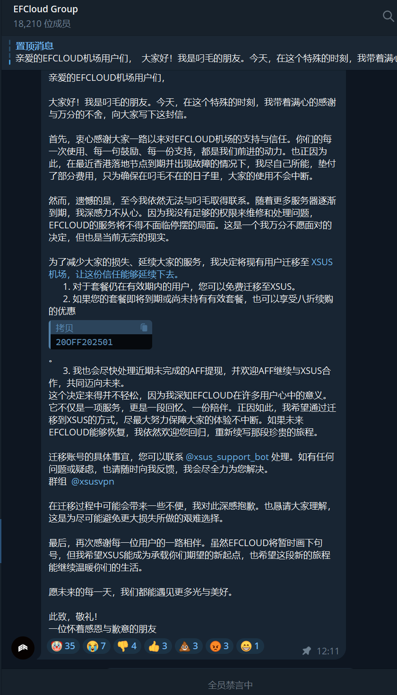

2025年1月25日，EFCloud 机场跑路，官网可以法访问，订阅无法使用。机场已证实跑路，不再推荐使用。

目前 [XSUS](https://xs-us.xyz/register?code=xJFcT1Dw) 正在接手EF用户，可转移部分订阅。详情可加TG群[@xsusvpn](https://t.me/xsusvpn)咨询

<!-- more -->

## 官方公告

### 截图

### 原文

> 亲爱的EFCLOUD机场用户们，
>
> 大家好！我是叼毛的朋友。今天，在这个特殊的时刻，我带着满心的感谢与万分的不舍，向大家写下这封信。
>
> 首先，衷心感谢大家一路以来对EFCLOUD机场的支持与信任。你们的每一次使用、每一句鼓励、每一份支持，都是我们前进的动力。也正因为此，在最近香港落地节点到期并出现故障的情况下，我尽自己所能，垫付了部分费用，只为确保在叼毛不在的日子里，大家的使用不会中断。
>
> 然而，遗憾的是，至今我依然无法与叼毛取得联系。随着更多服务器逐渐到期，我深感力不从心。因为我没有足够的权限来维修和处理问题，EFCLOUD的服务将不得不面临停摆的局面。这是一个我万分不愿面对的决定，但也是当前无奈的现实。
>
> 为了减少大家的损失、延续大家的服务，我决定将现有用户迁移至 XSUS机场，让这份信任能够延续下去。 [https://xsus.one/](https://xs-us.xyz/register?code=xJFcT1Dw)
>
> 1. 对于套餐仍在有效期内的用户，您可以免费迁移至XSUS。
> 2. 如果您的套餐即将到期或尚未持有有效套餐，也可以享受八折续购的优惠`20OFF202501`
> 3. 我也会尽快处理近期未完成的AFF提现，并欢迎AFF继续与XSUS合作，共同迈向未来。
>
> 这个决定来得并不轻松，因为我深知EFCLOUD在许多用户心中的意义。它不仅是一项服务，更是一段回忆、一份陪伴。正因如此，我希望通过迁移到XSUS的方式，尽最大努力保障大家的体验不中断。如果未来EFCLOUD能够恢复，我依然欢迎您回归，重新续写那段珍贵的旅程。
>
> 迁移账号的具体事宜，您可以联系 [@xsus_support_bot](https://t.me/xsus_support_bot) 处理。
>
> 如有任何问题或疑虑，也请随时向我反馈，我会尽全力为您解决。群组 [@xsusvpn](https://t.me/xsusvpn) 
>
> 在迁移过程中可能会带来一些不便，我对此深感抱歉。也恳请大家理解，这是为尽可能避免更大损失所做的艰难选择。
>
> 最后，再次感谢每一位用户的一路相伴。虽然EFCLOUD将暂时画下句号，但我希望XSUS能成为承载你们期望的新起点，也希望这段新的旅程能继续温暖你们的生活。
>
> 愿未来的每一天，我们都能遇见更多光与美好。
>
> 此致，敬礼！
> 一位怀着感恩与歉意的朋友

## 其他推荐机场

[https://www.pyjichang.com/](https://www.pyjichang.com/)